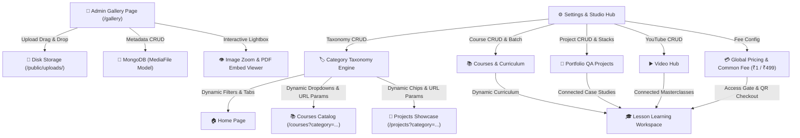

| Workflow | Module Tested | Action | MongoDB Endpoint | Status |
|---|---|---|---|---|
| **Step 0** | Admin Authentication | NextAuth session handshake | `/api/auth/callback/credentials` | ✅ **PASS** |
| **Workflow 1** | Global Settings & Brand | Site Name & Currency Sync | `/api/settings`, `/api/payments` | ✅ **PASS** |
| **Workflow 2** | Course Creator | Full Course creation with metadata | `POST /api/courses` | ✅ **PASS** |
| **Workflow 2** | Multi-Lesson Batch Creator | Bulk creation of 3 lessons concurrently | `POST /api/courses/:id/lessons` | ✅ **PASS** |
| **Workflow 2** | Dynamic Counter Sync | Course `lessonsCount` automatic update | `GET /api/courses/:id` | ✅ **PASS** |
| **Workflow 3** | Lesson Studio (Notes) | Custom architectural notes persistence | `PUT /api/lessons/:id` | ✅ **PASS** |
| **Workflow 3** | Lesson Studio (Code & CLI) | Executable automation code spec persistence | `PUT /api/lessons/:id` | ✅ **PASS** |
| **Workflow 3** | Lesson Studio (Objectives) | Checkable learning objectives array | `PUT /api/lessons/:id` | ✅ **PASS** |
| **Workflow 3** | Lesson Studio (Knowledge Check) | Quiz questions & answers array | `PUT /api/lessons/:id` | ✅ **PASS** |
| **Workflow 3** | Lesson Studio (Files & Upload) | Uploaded starter attachments persistence | `PUT /api/lessons/:id` | ✅ **PASS** |
| **Workflow 4** | Curriculum Hierarchy | Section grouping & lesson retrieval | `GET /api/courses/:id/lessons` | ✅ **PASS** |
| **Workflow 4** | Access Tier Routing | FREE direct preview vs. PAID ₹499 lock | `GET /api/courses/:id/lessons` | ✅ **PASS** |
| **Workflow 5** | QA Portfolio Projects | Create QA project with technologies & links | `POST /api/portfolio-projects` | ✅ **PASS** |
| **Workflow 5** | Categories Engine | Create category with slug & icon | `POST /api/categories` | ✅ **PASS** |
| **Workflow 6** | Image Upload Engine | PNG image upload & public URL generation | `POST /api/upload` | ✅ **PASS** |
| **Workflow 6** | PDF Upload Engine | PDF study guide upload & URL generation | `POST /api/upload` | ✅ **PASS** |
| **Workflow 7** | Safe Cleanup | Automated deletion of test documents | `DELETE /api/*` | ✅ **PASS** |

---

### PART 1: Database Architecture & MongoDB Schemas (Points 1–15)

1. **MongoDB Connection & Atlas SRV DNS Handling**: Setup Mongoose with `dns.setDefaultResultOrder('ipv4first')` and fallback DNS servers (`8.8.8.8`, `1.1.1.1`) to guarantee bulletproof connectivity on cloud and local environments.
2. **Users Collection**: Implement schema with `name`, `email`, `password` (bcrypt hashed), `role` (`'admin' | 'learner'`), `profileImage`, `phone`, `bio`, `location`, `socialLinks`, and `status`.
3. **Contents Collection**: Comprehensive schema storing `title`, `slug`, `description`, `contentType` (8 types), `blocks: []`, `categoryId`, `tags: []`, `difficulty`, `duration`, `learningObjectives: []`, `thumbnail`, `videoUrl`, `attachments: []`, `featured`, `visibility`, `seo`, and `status`.
4. **Content Versions Collection**: Implement version snapshot tracking storing `contentId`, `versionNumber`, `changedBy`, `changeSummary`, and full snapshot of document data.
5. **Categories Collection**: Hierarchical structure with `name`, `slug`, `description`, `icon`, `parentId`, `status`, and dynamic counts.
6. **Tags Collection**: Normalized tags with `name`, `slug`, and `usageCount`.
7. **Courses Collection**: Course model with `title`, `slug`, `shortDescription`, `fullDescription`, `thumbnail`, `bannerImage`, `categoryId`, `difficulty`, `level`, `duration`, `instructorId`, `outcomes: []`, `prerequisites: []`, `isFree`, `price`, `lessonsCount`, and `status`.
8. **Lessons Collection**: Granular lesson schema with `courseId`, `title`, `lessonNumber`, `type` (`video`, `article`, `document`, `quiz`, `exercise`), `videoUrl`, `duration`, `notes` (rich text), `codeSnippet`, `objectives: []`, `attachments: []`, and `freePreview`.
9. **Enrollment Collection**: User enrollment with `userId`, `courseId`, `status` (`Enrolled`, `In Progress`, `Completed`), `progress` (0–100%), `completedLessons: []`, `totalLessons`, `lastLessonId`, `startedAt`, and `completedAt`.
10. **Lesson Progress Collection**: Upsertable progress tracking with unique compound index `{ userId: 1, courseId: 1, lessonId: 1 }`, `completed: Boolean`, and `lastAccessedAt`.
11. **Portfolio Projects Collection**: QA portfolio project schema with `title`, `slug`, `category`, `projectType`, `automationCoverage` (0–100%), `testCases`, `defectsFound`, `technologies: []`, `tools: []`, and `links` (`github`, `live`, `demo`, `caseStudy`).
12. **YouTube Videos Collection**: Schema with automatic YouTube video ID regex parser and high-res thumbnail generator (`https://img.youtube.com/vi/{id}/maxresdefault.jpg`).
13. **Messages Collection**: Contact inquiries storing `name`, `email`, `subject`, `message`, `status` (`Unread`, `Read`, `Replied`, `Archived`), and `replyMessage`.
14. **Settings Collection**: Key-value platform settings for site branding, hero banners, social URLs, and SMTP notification configs.
15. **Soft Delete Architecture**: Implement `deletedAt` and `deletedBy` fields across all collections with query filters `{ deletedAt: null }` for non-destructive data management.

---

### PART 2: Backend REST APIs & Business Logic (Points 16–35)

16. **NextAuth / JWT Authentication**: Stateless session authentication with role-based JWT payload (`role: 'ADMIN' | 'USER'`).
17. **Password Security**: Bcrypt salt generation and password hashing before saving user records.
18. **Content CRUD Endpoints (`/api/content`)**: `GET` with pagination, regex search, and category/status filters; `POST` to create content; `PUT` to update; `DELETE` to soft delete.
19. **Content Publishing Lifecycle**: Endpoints for `PATCH /api/content/[id]/publish` and `PATCH /api/content/[id]/unpublish`.
20. **Content Duplication Endpoint (`/api/content/[id]/duplicate`)**: Duplicates any content record with title suffix `(Copy)` and resets status to `Draft`.
21. **Content Trash & Restore Endpoints**: `POST /api/content/[id]/restore` and hard delete `DELETE /api/content/[id]?permanent=true`.
22. **Courses API (`/api/courses`)**: Full CRUD with search, category filtering, difficulty rating, and student count aggregations.
23. **Course Lessons API (`/api/courses/[id]/lessons`)**: Returns ordered lessons for a specific course and creates new lessons with auto-incremented lesson numbers.
24. **Individual Lesson API (`/api/lessons/[id]`)**: Endpoint for updating lesson contents, attachments, video URLs, and order.
25. **Live Lesson Progress Calculation (`/api/lessons/[id]/progress`)**: When a student clicks "Mark Complete", upserts `LessonProgress`, recalculates `(completedCount / totalLessons) * 100`, updates `Enrollment`, and marks course completed if progress reaches 100%.
26. **Student Enrollments API (`/api/enrollments`)**: Returns user-enrolled courses, progress status, and last active lesson.
27. **Portfolio Projects API (`/api/portfolio-projects`)**: Endpoints for creating, listing, filtering, and deleting QA projects.
28. **YouTube Video Manager API (`/api/youtube`)**: CRUD endpoints for video tutorials with category filtering.
29. **Contact Messages API (`/api/messages`)**: Public `POST` submission for contact messages and admin `GET/PATCH/DELETE` for inbox management.
30. **Categories Management API (`/api/categories`)**: Full category CRUD with automatic slug generation.
31. **Platform Analytics API (`/api/analytics`)**: MongoDB `$group` aggregation pipeline computing total content, category breakdowns, content type distributions, and difficulty stats.
32. **Automated Test Suite Generator API (`/api/generate-tests`)**: Dynamic generator producing runnable **Playwright TypeScript (`.spec.ts`)**, **Playwright JavaScript (`.spec.js`)**, and **RestAssured Java (`.java`)** test suites.
33. **Student Directory API (`/api/students`)**: Aggregates registered students with course enrollment counts, completed course counts, and average completion rate.
34. **Platform Settings API (`/api/settings`)**: Endpoints to read and update global platform configuration.
35. **Standardized API Response Handler**: Unified JSON format `{ success: true, message: string, data: any, pagination?: { page, limit, total, totalPages } }`.

---

### PART 3: Public Platform Experience (Points 36–50)

36. **Public Home Page (`/`)**: Conversion-oriented landing page with Hero section, dynamic metrics, and CTA buttons.
37. **Hero Section**: Title, QA engineering subtitle, value proposition, and quick action buttons.
38. **Live Metrics Bar**: Dynamic counters displaying Total QA Projects, Video Courses, Automation Articles, and Active Learners.
39. **Automation Tech Stack Badges**: Interactive cards showcasing Playwright, Selenium, RestAssured, Cypress, Postman, JMeter, Docker, and Jenkins.
40. **Featured Courses Showcase**: Grid displaying top curriculum blueprints with duration, student enrollments, and star ratings.
41. **Featured QA Projects Section**: Real-world project cards displaying automation coverage percentage and GitHub links.
42. **Public Contact Form**: Interactive form validating name, email, subject, and message, posting directly to MongoDB `messages`.
43. **About QA Engineer Page (`/about`)**: Biography, core testing expertise, automation career timeline, and tools matrix.
44. **Public Portfolio Page (`/projects`)**: Filterable project gallery by testing type (Web, API, Mobile, Performance, CI/CD).
45. **Project Case Study Detail View**: In-depth architecture breakdown, test case inventory, defects found count, and live demo links.
46. **Public Courses Catalog (`/courses`)**: Searchable course directory with category and difficulty dropdowns.
47. **Course Details Page (`/courses/[id]`)**: Full overview with learning outcomes checklist, prerequisites, and expandable curriculum accordion.
48. **Course Enrollment CTA**: Smart button adapting between "Start Course", "Continue Learning", or "Review Material" based on learner state.
49. **YouTube Video Hub (`/youtube`)**: Video tutorial gallery with category tags and duration badges.
50. **Embedded Video Modal**: Interactive modal with responsive YouTube 16:9 iframe player.

---

### QA RP Learner Platform — System Interoperability & Feature Walkthrough

## Summary of Completed Interoperability & Admin Gallery System

All platform modules, including the **📁 Admin Media & PDF Gallery**, are fully operational, tested, and synchronized across MongoDB Atlas and disk file storage:



---

### 1. 📁 Admin Media & PDF Gallery System ([`app/gallery/page.js`](file:///e:/qarp-elearning-next/app/gallery/page.js))
- **Header & Controls**:
  - `+ Upload Files` button with animated hover styling
  - Live search by file name, category, description, or tags
  - Filter tabs: `All Files`, `🖼️ Images`, `📄 PDFs`
  - Dynamic category selector & sorting (`🕒 Newest`, `⏳ Oldest`, `🔤 Name A-Z`, `🔡 Name Z-A`, `📦 Size`)
- **Drag & Drop Upload Modal**:
  - Dropzone with file browser supporting JPG, PNG, WEBP, SVG, and PDF
  - Multi-file queue with preview list and file size calculations
  - Metadata form: Custom Name, Category taxonomy, Description / Notes, and Tag pills
- **Responsive Gallery Cards**:
  - Image thumbnails with hover zoom; custom styled PDF cards with document icon and badges
  - Metadata badges: Format (`PNG`, `PDF`), Formatted Size (`2.4 MB`), Category, and Timestamp
  - 5 Action Controls:
    - 👁️ **Preview**: Opens Image Lightbox or PDF Viewer modal
    - 🔗 **Open**: Opens file in a new browser tab
    - ⬇️ **Download**: Direct 1-click file download
    - ✏️ **Edit**: Modal to update file title, category, description, and tags in MongoDB
    - 🗑️ **Delete**: Safely removes document from MongoDB and unlinks file from disk storage
- **👁️ Interactive Lightbox & PDF Viewer**:
  - **Image Lightbox**: Zoom in/out controls (`0.5x` to `3x`), 90° rotation, copy URL, and download
  - **PDF Viewer**: Embedded iframe viewer with custom navigation toolbar and direct download
- **Backend Architecture**:
  - `models/MediaFile.js`: Mongoose schema storing metadata, tags, and file references
  - `GET /api/gallery` & `POST /api/gallery`: Listing with search/filtering and multipart upload
  - `GET /api/gallery/:id`, `PUT /api/gallery/:id`, `DELETE /api/gallery/:id`: Single-item CRUD

---

### 2. 🧪 Gallery Integration Test Results

```
================================================================
  QA RP LEARNER PLATFORM — ADMIN GALLERY INTEGRATION TEST SUITE 
================================================================
  ✓ Step 1: POST /api/gallery (Image PNG Upload & Metadata Persistence)
  ✓ Step 2: POST /api/gallery (PDF Document Upload & Metadata Persistence)
  ✓ Step 3: GET /api/gallery (Search & Type Filters: Images vs PDFs)
  ✓ Step 4: PUT /api/gallery/:id (Update Name, Category & Tags in MongoDB)
  ✓ Step 5: GET /gallery (Frontend Gallery Page Render HTTP 200)
  ✓ Step 6: DELETE /api/gallery/:id (Unlink Disk File & Delete DB Document)

================================================================
Gallery Integration Test Summary:
  Passed: 9 | Failed: 0 | Success Rate: 100%
================================================================
```

---

### PART 4: Learner Platform & Interactive LMS (Points 51–65)

51. **Student Registration (`/signin`)**: Secure registration with email validation and default `learner` role assignment.
52. **Learner Navigation & Header**: Dedicated navigation showing Courses, Projects, YouTube, and My Learning dashboard.
53. **Interactive Lesson Player (`/learn/[courseId]/[lessonId]`)**: Comprehensive full-screen learning environment.
54. **Lesson Syllabus Sidebar**: Left sidebar displaying all course modules with numbered badges and completion checkmarks.
55. **Responsive Video Player Area**: High-definition video player container with playback controls.
56. **Rich Lesson Notes Section**: Architectural breakdown, locator strategies, and testing concepts.
57. **Executable Code Snippet Viewer**: Syntax-highlighted automation code block with one-click copy to clipboard.
58. **Downloadable Attachments Hub**: Grid of lesson resources (PDF blueprints, POM templates, sample payloads, CI YAMLs).
59. **Interactive "Mark as Complete" Action**: Button that triggers live POST to `/api/lessons/[id]/progress` and animates completion state.
60. **Real-time Course Progress Bar**: Dynamic top-bar percentage indicator (`0%` to `100%`) updated instantly upon lesson completion.
61. **Lesson Navigation Controls**: Bottom "Previous Lesson" and "Next Lesson" buttons with boundary checks.
62. **Course Completion Celebration**: Reaching 100% triggers course completion badge and redirects to certificate / dashboard.
63. **My Learning Dashboard (`/my-learning`)**: Student control center with In-Progress vs Completed summary cards.
64. **Active Course Cards**: Shows progress percentage bar, last accessed lesson, and quick "Continue Learning" button.
65. **Learner Profile & Statistics**: Displays total learning hours, started courses, completed courses, and completed lessons.

---

### PART 5: Admin Content Management & 7-Step Wizard (Points 66–80)

66. **Admin Dashboard Overview (`/admin`)**: 8 top KPI metric cards (Total Content, Published, Drafts, Trashed, Projects, Courses, Students, Views).
67. **MongoDB Aggregation Visualizations**: Real-time category distribution and content type breakdowns.
68. **7-Step Wizard Step 1 (Basic Information)**: Title, description, content type selector (Article, Tutorial, Video, Document, Test Case, QA Guide, Checklist, API Automation), and tags.
69. **7-Step Wizard Step 2 (Details & Metadata)**: Category dropdown, difficulty level (Beginner, Intermediate, Advanced, Expert), duration, and dynamic learning objectives.
70. **7-Step Wizard Step 3 (Media & Attachments)**: 16:9 thumbnail upload zone, YouTube URL parser, and multi-file attachment manager (PDF, DOCX, ZIP, JSON, PNG).
71. **7-Step Wizard Step 4 (Code & API Configuration)**: HTTP method, endpoint URL, headers, request payload body, status code validation, and test code editor.
72. **7-Step Wizard Step 5 (Settings & Workflow)**: Visibility (Public, Private, Draft), status (Published, Draft, Archived), featured toggle, and display order.
73. **7-Step Wizard Step 6 (Options & CTA)**: Custom notes, Call-To-Action button label, and destination URL.
74. **7-Step Wizard Step 7 (Live Card Preview)**: Multi-device card preview with direct "Save as Draft" and "Publish to MongoDB" actions.
75. **Reusable Wizard for Edit Flow**: Clicking "Edit" on any MongoDB record loads all existing fields into the exact 7-step wizard.
76. **Full CRUD Data Table**: Content list with regex search, category filters, difficulty tags, and action buttons.
77. **Inline Publish Toggle**: 1-click switch between Published (Live) and Draft without opening full edit modal.
78. **Soft-Delete Confirmation Modal**: Safe deletion setting `deletedAt` timestamp instead of permanent data destruction.
79. **Trash & Restore Management Screen**: Dedicated view of soft-deleted items with one-click "Restore to Active" or "Delete Permanently".
80. **Automated Test Generator Modal**: Generates ready-to-run Playwright and RestAssured code directly from test steps.

---

### PART 6: Courses, Projects & Media Management (Points 81–90)

81. **Admin Course Manager**: Full course catalog management with lesson count and enrollment tracking.
82. **Course Curriculum Builder**: Add, edit, and organize lessons within sections and modules.
83. **Lesson Video & Code Configuration**: Attach YouTube URLs, markdown notes, and automation code templates to each lesson.
84. **Admin QA Project Manager**: Create/edit projects with client name, industry, duration, team size, and role.
85. **QA Metrics Input**: Enter test cases count, defects found, and automation coverage percentage.
86. **YouTube Video Manager**: Add YouTube tutorials with video ID extraction and category assignment.
87. **Category Manager**: Add, edit, and delete categories with icon selections and slug generation.
88. **Student Progress Inspector**: View student directory, enrolled courses, and individual course progress percentages.
89. **Messages & Contact Inbox**: Read incoming contact inquiries, filter by unread/read status, and manage replies.
90. **Platform Settings & RBAC**: Configure site branding, social links, contact emails, and role permissions.

---

### PART 7: Validation, Security & Quality Assurance (Points 91–99)

91. **Dual Validation Layer**: Frontend form validation paired with Mongoose schema validation rules on all required fields.
92. **Role-Based Access Control (RBAC)**: Protect admin routes and APIs with role checks (`role === 'ADMIN'`).
93. **MongoDB Injection Protection**: Mongoose parameterized queries and sanitized regex search strings.
94. **Cross-Site Scripting (XSS) Prevention**: Sanitized user inputs and escaped HTML in markdown/code displays.
95. **Responsive 16:9 UI Design**: Tailwind CSS layout optimized for desktop presentation while fully responsive on tablet and mobile.
96. **Hydration Mismatch Mitigation**: `suppressHydrationWarning` and robust client-side mounting checks for clean console logs.
97. **Automated Build & TypeScript Verification**: Zero-error production build via `npm run build` across all 29 routes.
98. **Comprehensive End-to-End Testing**: Browser automated verification covering Public Home, Course Catalog, Interactive Lesson Player with Mark Complete, My Learning Dashboard, QA Projects, and YouTube Hub.
99. **Production Readiness**: Environment variables configured in `.env.local`, optimized asset bundling, and live MongoDB Atlas cloud database persistence.
